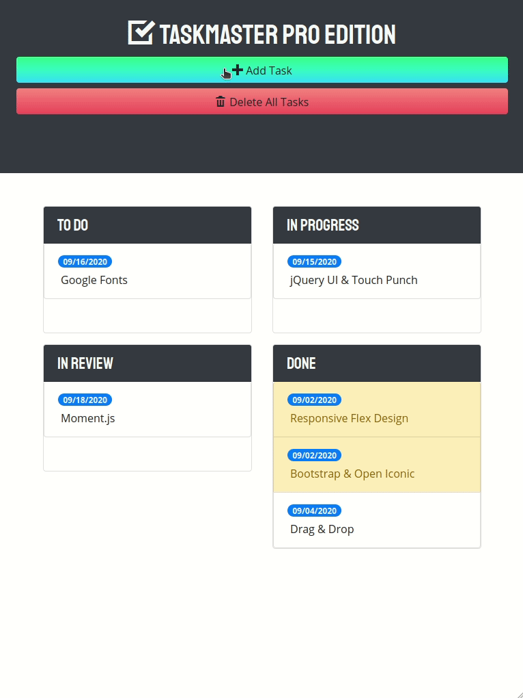

# Taskmaster Pro

> Kanban style task manager concept.  

- [x] [Add task editing](https://github.com/MBrassey/taskmaster-pro/issues/1)
- [x] [Update layout for new statuses](https://github.com/MBrassey/taskmaster-pro/issues/2)
- [x] [Add drag/drop capabilities](https://github.com/MBrassey/taskmaster-pro/issues/3)
- [x] [Add due date handling ](https://github.com/MBrassey/taskmaster-pro/issues/4) 
- [x] [Customize/improve user experience ](https://github.com/MBrassey/taskmaster-pro/issues/5)
<h6>
[ Click the below image to view the <a href="https://MBrassey.github.io/taskmaster-pro/">webapplication</a> ]
</h6>

[
](https://MBrassey.github.io/taskmaster-pro/)