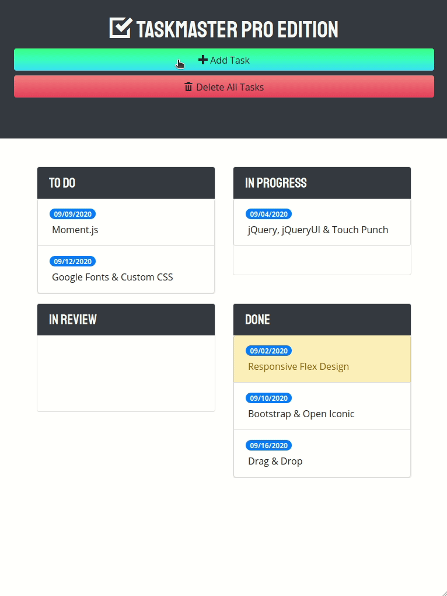

#### Taskmaster Pro

Kanban style task manager concept using jQuery/JS/HTML/CSS.

- [x] [Add task editing](https://github.com/MBrassey/taskmaster-pro/issues/1)
- [x] [Update layout for new statuses](https://github.com/MBrassey/taskmaster-pro/issues/2)
- [x] [Add drag/drop capabilities](https://github.com/MBrassey/taskmaster-pro/issues/3)
- [x] [Add due date handling ](https://github.com/MBrassey/taskmaster-pro/issues/4) 
- [x] [Customize/improve user experience ](https://github.com/MBrassey/taskmaster-pro/issues/5)

<h6>
:cyclone: Click the image(s) below to view the live <a id="Screenshots" href="https://MBrassey.github.io/taskmaster-pro/">webapplication</a>
</h6>

[
](https://MBrassey.github.io/taskmaster-pro/)

#### Questions
Contact me at [matt@brassey.io](mailto:matt@brassey.io) with any questions or comments.

#### License
`Taskmaster-Pro` is published under the __CC0_1.0_Universal__ license.

> The Creative Commons CC0 Public Domain Dedication waives copyright interest in a work you've created and dedicates it to the world-wide public domain. Use CC0 to opt out of copyright entirely and ensure your work has the widest reach. As with the Unlicense and typical software licenses, CC0 disclaims warranties. CC0 is very similar to the Unlicense.